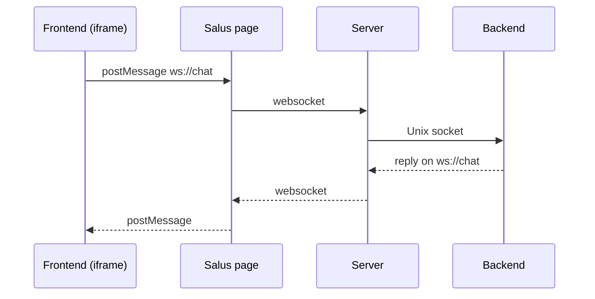

# How it fits together

## Instances

| Thing | What it is | Lifetime |
|---|---|---|
| **Plugin** | A folder with a manifest, a backend and a frontend. Identified by its folder name. | Installed on disk. |
| **Frontend component** | One of the plugin's pages (`[[frontend-component]]` in the manifest). A plugin has one or more. | Declared in the manifest. |
| **Frontend instance** | One running copy of a component, in an iframe, with a numeric **frontend id**. | Created when the user opens the plugin, or when a component, plugin or file open asks for it; gone when its tab closes. |
| **Backend process** | The plugin's backend. All components of one plugin instance share one backend. | Set by `lifetime` in the manifest: a `panel` backend ends with its last frontend; `session` and `system` backends keep running and are reused by later frontends (of the same user, or of any user). |

Because one backend serves several frontends, every message the backend receives says which frontend sent it, and
every message it sends names the frontend it is for (or *all* of them).

!!! info "Ids are not stable"
    Frontend ids (starting at 30000) and backend ids (starting at 20000) are handed out in order and **restart when
    the server restarts**. Never persist them, and never use them as part of a cache key that outlives a session.

## Four ways to communicate

| | Between | Use it for | API |
|---|---|---|---|
| **Channels** (`ws://name`) | frontend ↔ backend | Events, commands, streams of messages in either direction | `@app.channel`, `salus.channel()` |
| **HTTP routes** | frontend → backend | Requests with a response: data, files, images, tiles | `@app.route`, `salus.http` |
| **Peer channels** (`peer://id/name`) | frontend ↔ frontend | Talking to your own plugin's other components, or steering a plugin you opened (or the one that opened you) | `salus.openComponent()`, `salus.openDependency()`, `salus.parent`, `salus.components()` |
| **Control requests** (`salus://topic`) | plugin → framework | Asking Salus to do something, such as opening a dependency | `salus.request()`, `app.request()` |

### Channels

Messages are opaque bytes. You decide the format; [`Payload`](../guides/payloads.md) has helpers for text, JSON and
binary records. They are delivered at most once and are **not** buffered for channels nobody listens on yet.

### HTTP routes

The backend opens routes such as `GET /doc/{id}`. The frontend calls
`/plugin-api/<frontend id>/doc/42` with an ordinary request (`fetch`, ``, ...). The server checks the
session, forwards the request to the backend over its socket, and turns the backend's answer back into the
HTTP response. Details in [HTTP routes](../guides/http.md).

### Peer channels, components and dependencies

The components of one plugin can open each other and exchange messages; the Salus page delivers those messages **inside the browser**, so they stay fast and
never touch the server. A plugin can also declare other plugins as [dependencies](../guides/dependencies.md) and open them; those two frontends
exchange messages through the server, which only allows a frontend and the one that opened it to talk. Plugins can also ask Salus to [open a file](../guides/file-viewers.md)
in whatever viewer is installed.

## Where things run

- Frontends run in the user's browser, as iframes of the Salus page, served from the framework's own origin.
- The Salus page relays channel and peer messages between iframes and the server over one websocket per page.
- Backends run as separate processes on the machine that hosts Salus, connected by a Unix socket each.
