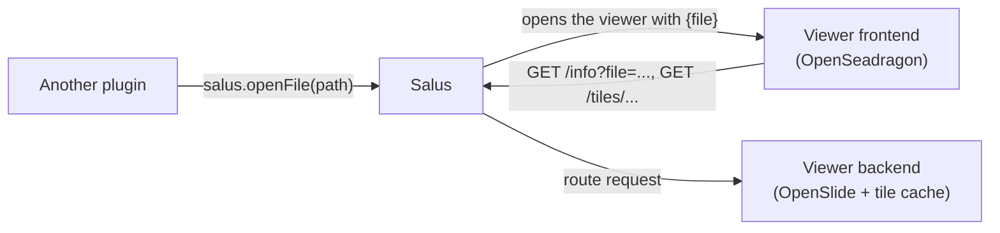

# Tutorial: a whole slide viewer

This tutorial walks through a real plugin that ships in `examples/plugins/`:

**Image Viewer** (`org.salus.imageviewer`) shows a whole slide image (a pathology scan with billions of pixels) using
[OpenSeadragon](https://openseadragon.github.io/). Its backend opens the slide file and produces the image tiles
on demand. It is a **file viewer**: it never appears in the **+** list. Another plugin (for example the Dataset Workbench)
calls `salus.openFile(path)` and Salus opens the viewer for that file.

It uses nearly everything in the SDK: [file viewers](file-viewers.md), [HTTP routes](http.md) for tiles and a
backend [`main`](backend.md#your-own-main-coroutine)-style background task to warm a cache.



## The manifests

The viewer has no `entry-component`, so it is not in the **+** list. `file_viewer_for` lists the file types Salus opens with it.

```toml title="org.salus.imageviewer/manifest.toml"
--8<-- "examples/plugins/org.salus.imageviewer/manifest.toml"
```

## The viewer backend

### Serving tiles over HTTP

OpenSeadragon displays huge images with a *Deep Zoom* pyramid: many small tiles per zoom level, requested by URL
as the user pans and zooms. OpenSlide (with `DeepZoomGenerator`) cuts tiles out of the slide file, so the backend
only has to answer one route:

```python title="backend/plugin.py (routes)"
--8<-- "examples/plugins/org.salus.imageviewer/backend/plugin.py:routes"
```

Two details worth copying:

- **The slide id in the URL.** `/info` returns a hash of the slide file, and tiles live under
  `/tiles/<slide id>/...`. A tile therefore never changes under its URL, so it is safe to send
  `Cache-Control: ... immutable`. This matters because frontend ids restart with the server (see
  [HTTP routes](http.md#things-to-know)).
- **`/info` is `no-store`.** It is the entry point: it opens the slide the frontend names (`?file=...`) and tells the frontend which slide id to load. One backend serves many slides, because the backend lives as long as the session (`lifetime = "session"`).

### Keeping tiles in RAM

Rendering a tile is cheap but not free, and viewers request the same tiles again and again. The backend keeps
encoded JPEGs in a byte-limited LRU cache, and concurrent requests for the same tile share one render:

```python title="backend/plugin.py (tile cache)"
--8<-- "examples/plugins/org.salus.imageviewer/backend/plugin.py:cache"
```

The blocking OpenSlide call runs in a worker thread (`asyncio.to_thread`), so while one tile renders the event loop keeps
answering other requests. When a slide is opened, a background task renders its small overview levels so the first view appears at once.

### Python packages and the slide

The backend needs `openslide-python`, so the plugin carries its own virtual environment and the manifest points at a
launcher script (`backend/run.sh`) that starts the venv's Python. See [Plugin anatomy](../getting-started/plugin-anatomy.md#dependencies-of-your-backend).
The slides are not part of the plugin: the viewer opens the file Salus gives it (a path on the server).

## The viewer frontend

The page reads the file from its parameters (`salus.params.file`), asks the backend about the slide, then hands OpenSeadragon a Deep Zoom description
whose tile URL points at the backend's route. OpenSeadragon does the rest with ordinary `GET` requests:

```js title="frontend/script.js (OpenSeadragon)"
--8<-- "examples/plugins/org.salus.imageviewer/frontend/script.js:openseadragon"
```

`salus.http.url(...)` produces the `/plugin-api/<frontend id>/...` URL that Salus forwards to the backend.

### Zoom and move buttons

OpenSeadragon's own navigation buttons are used. Its default button images are files, so the plugin supplies small inline SVGs instead and needs no extra files:

```js title="frontend/script.js (controls)"
--8<-- "examples/plugins/org.salus.imageviewer/frontend/script.js:controls"
```

## Run it

```sh
cd examples/plugins/org.salus.imageviewer/backend
./setup.sh                          # creates .venv with OpenSlide (Python 3.10+)
```

Copy the plugin folder into the Salus plugins directory and restart the server. Then open a slide from any plugin that calls
`salus.openFile`, for example from the source browser of the Dataset Workbench, or try the [Components Demo](file-viewers.md).

## What it demonstrates

| Need | Feature used |
|---|---|
| Serve many small binary files by URL | [HTTP routes](http.md) with `{path}` parameters |
| Make it fast | Backend RAM cache, shared in-flight renders, worker threads, `immutable` caching |
| Open files for other plugins | [File viewers](file-viewers.md) (`file_viewer_for`, `salus.params.file`) |
| Reuse a JS library | Ship the library file in the plugin's `frontend/` folder |
| Heavy Python dependencies | Per-plugin virtualenv and a launcher script |
