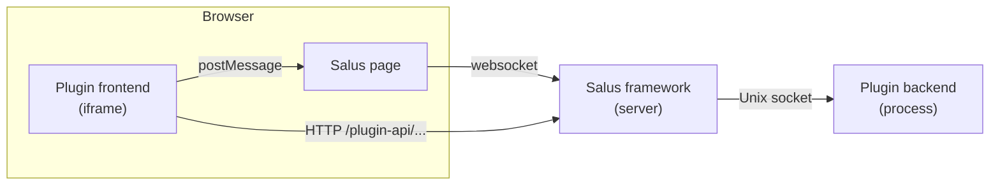

# Salus plugin developer docs

Salus is a web framework that hosts **plugins**: small applications that run side by side in a
workspace, much like the panels of an IDE. A plugin has two halves that Salus connects for you:

- a **frontend**: a web page (HTML and JavaScript) that Salus shows in an iframe, and
- a **backend**: a process (Python, with an SDK provided) that does the heavy lifting and talks to the frontend.

Plugins describe themselves in a `manifest.toml`. Salus finds them, starts their backends, shows their
frontends, and moves messages between them.

## What the framework gives your plugin

| You want to... | Use | Read |
|---|---|---|
| Send messages between frontend and backend in both directions | **Channels** (`ws://`) | [Python backend](guides/backend.md), [JavaScript frontend](guides/frontend.md) |
| Let the frontend fetch data or files from the backend | **HTTP routes** | [HTTP routes](guides/http.md) |
| Split your interface into several pages that open and message each other | **Frontend components** | [Frontend components](guides/components.md) |
| Show another plugin next to yours and steer it | **Dependencies and peers** | [Plugin dependencies](guides/dependencies.md) |
| Show a file in whatever viewer is installed | **File viewers** | [File viewers](guides/file-viewers.md) |
| Send structured binary data | **Payloads** | [Payloads](guides/payloads.md) |

## Where to start

1. Build and run a tiny plugin in the [Quickstart](getting-started/quickstart.md).
2. See how a plugin is laid out in [Plugin anatomy](getting-started/plugin-anatomy.md).
3. Read the two guides for your [backend](guides/backend.md) and [frontend](guides/frontend.md).
4. Follow the [whole slide viewer tutorial](guides/image-viewer.md) for a real plugin that serves
   gigapixel pathology images with OpenSeadragon and is steered by a second plugin.

The SDKs themselves are single files you copy into your plugin:
`sdk/python/salus_sdk.py` for the backend and `sdk/js/salus_sdk.js` for the frontend (both in the Salus repository).

!!! note "Status"
    Salus is under active development. Pages mark behavior that is not final yet, for example
    manifest keys that are read but not acted on yet (see the [manifest reference](reference/manifest.md)).
